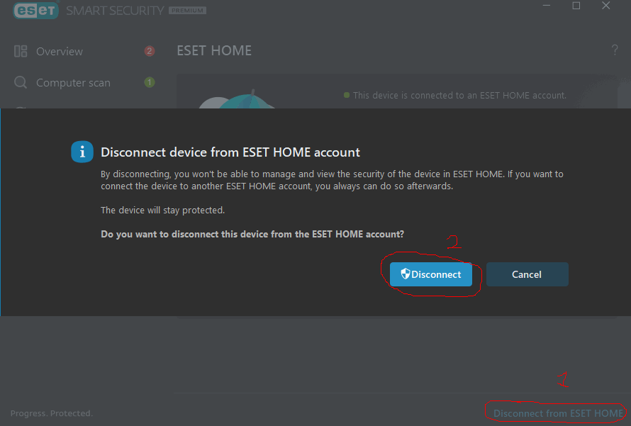
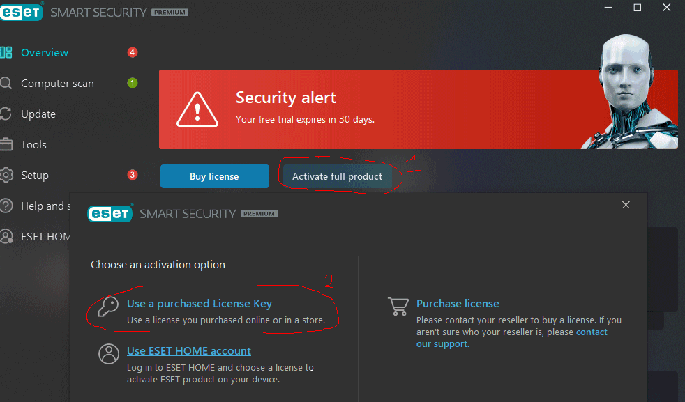

# Eset-license-key
Inbox for password :([Mr.Cyb3rgh0st](https://t.me/MrCyb3rgh0st))
Eset-license-key - Key generator for ESET Antivirus ([Mr.Cyb3rgh0st](https://github.com/Mr-Cyb3rgh0st))

# How to use

## Installing google chrome and driver
> The script can be run without downloading chrome and its driver. The program will automatically install everything.
> If everything works, you can skip the installation of Google Chrome and driver.

> If for some reason the program does not work, you need to install everything manually.
> Follow the instructions below
### Windows
1. Download and install [Chrome](https://www.google.com/chrome/)
2. Download stable [ChromeDriver](https://chromedriver.chromium.org/downloads) and extract to the folder where the ESET KeyGen.py file or the build executable is located!

> If your version of Chrome is for example 115.0.5790.102 then you need to download a driver
      with the same version (Only the first 3 digits are taken into account, for example, 115)
> 
> If you can't find the version you need, follow [this link](https://googlechromelabs.github.io/chrome-for-testing/#stable) and find the stable version you need there

### Linux (Using Debian as an example)
1. Download [Chrome](https://www.google.com/chrome/) .deb package and install the downloaded package using the command in terminal:

```
apt install %path to deb%
```

2. Download stable [ChromeDriver](https://chromedriver.chromium.org/downloads) for linux64 platform and extract to /usr/bin

> If your version of Chrome is for example 115.0.5790.102 then you need to download a driver
      with the same version (Only the first 3 digits are taken into account, for example, 115)

> If you can't find the version you need, follow [this link](https://googlechromelabs.github.io/chrome-for-testing/#stable) and find the stable version you need there

## Installing Python and libraries

> This step can be skipped by loading a build from releases (only if the build version matches the version of the code in the branch)

1. Go to the official [Python website](https://www.python.org/downloads) and download the version for your system (the project runs starting with Python 3.7.0)

2. Next, install the Python libraries, in the terminal:

```
pip install selenium requests
```

## Preparing ESET

Delete your current ESET HOME account



## Using the repository
1. Run the ESET KeyGen.py file or the assembly executable and wait for "Press Enter..." to appear.
After that, you will see in the console the key and the license expiration date.

This information will also be written to a file named "Today date - ESET KEYS.txt"


### In Linux (Kali):


3. In ESET, click Activate full version of the product with purchased License Key and enter the key from the console in the box that appears



> Just click "Continue" until you are told that you have successfully activated the antivirus.

# Recommendations and information

1. Do not minimize or close the browser window before the program is finished!!!
2. Do not create many license keys in a short period of time, otherwise, you will be blocked in ESET HOME for a certain period of time
3. If the program crashes after many attempts and you know that the program is up to date. Try using a VPN
4. If an ACT0 error occurs during activation, check whether the ESET HOME account is connected. If so, disconnect it and try again. If the error persists, reinstall ESET 
5. If you get an error related to an old version of the driver or Chrome. You need to update the driver to the chrome version or chrome to the driver version


# Acknowledgements


##Coded

`Mr. Cyb3rgh0st`

